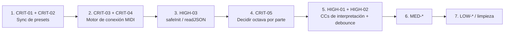

# Auditoría completa del Mixer — CasioController v180

> **Fecha:** 2026-10-04 (COT)
> **Versión auditada:** `app.js?v180` (commit `e7d74cc`), `index.html`, `fix_swap.js?v=136`, `raw_tones.js`
> **Alcance:** todo lo que afecta al Mixer — motor MIDI, selección de tonos, EQ/efectos, perfiles por ambiente, sustain, transposición/octava, swap de partes, estado persistente, presets + sync GitHub, y el PC Synth / MIDI CTRL en lo que comparten estado con el Mixer.
> **Estado:** solo hallazgos, **sin cambios al código**. Los números de línea corresponden a v180 y pueden desplazarse.
> **Reemplaza a:** [`MIXER_AUDIT.md`](../MIXER_AUDIT.md) (v170). El estado de esos hallazgos se revisa al final.

---

## Resumen ejecutivo

| Severidad | Cantidad | Qué significa |
|-----------|----------|---------------|
| 🔴 Crítico | 5 | Pérdida de datos, desincronización silenciosa entre la app y el Casio, o cortes de sonido en vivo |
| 🟠 Alto | 4 | Comportamiento incorrecto visible al tocar, o un punto único de falla que deja la app muerta |
| 🟡 Medio | 9 | Bugs reales con impacto acotado o en escenarios específicos |
| ⚪ Bajo / deuda | 10 | Código muerto, inconsistencias, documentación desactualizada, riesgos a futuro |

**Los 3 más graves:**

1. **La sincronización de presets con GitHub corrompe los nombres con acentos/ñ y puede perder presets** (CRIT-01, CRIT-02).
2. **Cada evento de puerto MIDI reenvía todos los tonos al Casio** — 2 a 3 recargas completas al conectar y cortes de sonido si un puerto "parpadea" en vivo (CRIT-03, CRIT-04).
3. **La octava por parte nunca llega al Casio, pero sí al PC Synth** — estado oculto sin UI que puede dejar los dos sonando a octavas distintas (CRIT-05).

---

## 🔴 Críticos

### CRIT-01 — Pull de GitHub decodifica mal UTF-8: los nombres con acentos se corrompen y la corrupción crece

**Archivo:** [app.js L1308](../app.js#L1308) (`syncPull`) vs [L1326](../app.js#L1326) (`syncPush`)

```js
// push: codifica correctamente UTF-8 → base64
const content = btoa(unescape(encodeURIComponent(JSON.stringify(presets, null, 2))));
// pull: NO decodifica UTF-8
const cloud = JSON.parse(atob(json.content.replace(/\n/g, '')));
```

`atob` devuelve los bytes UTF-8 crudos como caracteres Latin-1. Un preset llamado `Canción` vuelve como `Canción`. Como el merge es por nombre (`Object.assign(local, cloud)`), aparece **un preset duplicado** con el nombre corrupto. En el siguiente push, ese nombre corrupto se vuelve a codificar → `Canción` → la corrupción **se duplica en cada ciclo push/pull**.

**Impacto:** para un usuario hispanohablante prácticamente cualquier preset con tilde o ñ queda duplicado y corrupto, de forma permanente en el repositorio.

**Fix propuesto:** `JSON.parse(decodeURIComponent(escape(atob(b64))))`, o mejor `new TextDecoder().decode(Uint8Array.from(atob(b64), c => c.charCodeAt(0)))`. Agregar una migración de una sola vez que detecte y repare claves con `Ã`.

---

### CRIT-02 — El merge "cloud gana" + `syncPull` dentro de `syncPush` pierde guardados y resucita presets borrados

**Archivo:** [app.js L1309-L1312](../app.js#L1309-L1312), [L1324](../app.js#L1324), [L1466](../app.js#L1466), [L1557](../app.js#L1557)

- `syncPush` llama `syncPull` cuando `ghFileSha` es `null` (p. ej. la app arrancó sin conexión o el pull inicial falló). `syncPull` aplica `Object.assign({}, local, cloud)` → **la nube pisa lo local**.
  - Sobrescribir un preset estando sin SHA → el pull restaura la versión vieja de la nube → **el guardado se pierde** y se sube la versión vieja.
  - Borrar un preset estando sin SHA → el pull lo vuelve a traer → **el preset borrado resucita**.
- Los borrados nunca se propagan entre dispositivos: el merge es una unión, así que un preset borrado en el celular vuelve desde el PC.
- `captureAndSavePreset` y el botón Delete disparan `syncPush()` sin esperar ni encolar. Dos acciones seguidas mandan dos PUT con el mismo SHA → el segundo falla con **409 Conflict** y el estado local y el remoto divergen.

**Fix propuesto:** PUT condicional con reintento (si da 409: hacer GET, merge de tres vías, PUT de nuevo); cola de sync serializada; tombstones (`{deleted:true, ts}`) para los borrados; timestamp `updatedAt` por preset y que gane el más reciente, no "cloud siempre gana".

---

### CRIT-03 — `onstatechange` reenvía todos los tonos (Program Changes) en cada evento de puerto

**Archivo:** [app.js L322](../app.js#L322), [L365-L379](../app.js#L365-L379)

```js
access.onstatechange = () => sReedndConnect();   // cualquier puerto, cualquier cambio
...
midiOutput.open()                // dispara statechange (connection → "open")
midiInput.onmidimessage = ...    // abre el input implícitamente → otro statechange
if (midiOutput) pushAllToKeyboard();   // 3 PCs + ~85 CCs
```

Según la especificación Web MIDI, `statechange` se dispara también cuando un puerto pasa de `closed` a `open`. Secuencia al conectar:

1. `requestMIDIAccess` → `sReedndConnect` → **push #1**
2. `midiOutput.open()` → statechange → **push #2**
3. abrir el input → statechange → **push #3**

Cada push manda Bank/PC a las 3 partes → el Casio recarga los 3 tonos (las notas sostenidas se cortan) más ~85 CCs, justo el tipo de ráfaga que el README dice que hace que el Casio descarte mensajes. Además, cualquier evento posterior (enchufar otro dispositivo MIDI, un parpadeo del adaptador Bluetooth WU-BT10, un puerto virtual que aparece) **recarga los tonos en medio de una canción**.

**Fix propuesto:** en `onstatechange`, re-seleccionar puertos solo si `e.port.state` cambió (no `connection`) y solo hacer push si el **id** del output elegido es distinto del anterior. Hacer debounce de ~300 ms.

---

### CRIT-04 — Doble `requestMIDIAccess` si el primer click es en el badge de estado

**Archivo:** [app.js L211-L215](../app.js#L211-L215) y [L1773-L1775](../app.js#L1773-L1775)

El badge `.status-badge` tiene su propio listener (`if (midiAccess) ... else initMIDI()`). El listener `{once:true}` del `document` también llama `initMIDI()` porque `midiInitAttempted` sigue en `false` (solo el `connectBtn` lo pone en `true`). Si el primer toque del usuario es en el badge (que es lo natural para "conectar"):

- se crean **dos** `MIDIAccess`, cada uno con su `onstatechange`;
- desde ahí, **cada** evento de puerto ejecuta `sReedndConnect` dos veces → los pushes de CRIT-03 se duplican durante toda la sesión;
- en Android puede salir dos veces el diálogo de permiso o fallar con "platform dependent initialization failed".

**Fix propuesto:** un único `ensureMIDI()` con una promesa memoizada (`midiAccessPromise ??= navigator.requestMIDIAccess(...)`) que usen todos los puntos de entrada.

---

### CRIT-05 — La octava por parte es estado oculto: nunca llega al Casio, pero sí transpone el PC Synth

**Archivos:** [app.js L1721-L1732](../app.js#L1721-L1732) (`sendCoarseTuning`), [L409-L411](../app.js#L409-L411) (hook del PC Synth), [L1248-L1250](../app.js#L1248-L1250), [fix_swap.js L66-L78](../fix_swap.js#L66-L78)

```js
// sendCoarseTuning — ignora tuning[part].oct
const total = 64 + globalOctave * 12 + globalTranspose;
// hook del PC Synth — SÍ lo usa
const octOffset = tuning[partKey]?.oct ? tuning[partKey].oct * 12 : 0;
const shift = globalTranspose + globalOctave * 12 + octOffset;
```

- `index.html` **ya no tiene** elementos `oct-U1/U2/L` ni botones `data-action="oct±/oct-reset"` → no hay UI para ver ni cambiar la octava por parte.
- Pero `tuning[part].oct` sigue vivo: se guarda en `casioAppState` cada segundo, se guarda en presets, se restaura con `loadAppState` / `loadPreset`, y **se aplica al PC Synth**.
- El `oct-reset` histórico ponía `U1 = -1`. Cualquier estado o preset guardado en esa época deja el PC Synth sonando **una octava abajo del Casio** en U1, sin que nada en pantalla lo muestre ni permita corregirlo.
- `fix_swap.js` busca `.btn-reset-small[data-action="oct-reset"]` para "forzar las octavas por canal" → hoy el resultado es `null`; esa parte del swap es código muerto.

**Fix propuesto:** decidir el modelo. (a) Eliminar la octava por parte: quitarla del estado, de los presets y del hook del PC Synth, y migrar con `oct = 0`. O (b) restaurarla de punta a punta: UI + incluir `tuning[part].oct * 12` en `sendCoarseTuning`.

---

## 🟠 Altos

### HIGH-01 — Controles de interpretación (Sostenuto, Soft, Modulación, Portamento) se guardan "por tono" y se resetean en cada cambio

**Archivo:** [app.js L160-L172](../app.js#L160-L172) (`saveToneEQForPart`), [L732-L734](../app.js#L732-L734) y [L763-L782](../app.js#L763-L782) (`applySmartProfile`)

- `saveToneEQForPart` copia **todo** `eqState` excepto CC7 y CC72. Eso incluye **CC66 Sostenuto, CC67 Soft, CC65 Portamento y CC1 Modulación**. Si el usuario activa SOFT un momento y después mueve cualquier fader, SOFT queda **guardado ON para ese tono en ese ambiente** y se reactiva cada vez que se carga el tono.
- También entran en el perfil los valores que mandó el propio Casio (los CC entrantes actualizan `eqState`, [L445](../app.js#L445)).
- A la inversa, `applySmartProfile` manda `CC66=0`, `CC67=0` y `CC1=0` en **cada** cambio de tono, de ambiente o Reset → si el usuario tiene el Sostenuto activo y cambia de tono, se suelta.

**Fix propuesto:** lista explícita `PERFORMANCE_CCS = [1, 64, 65, 66, 67, 72, 7]` que se excluya de `toneEQ`, de presets y del reset en `applySmartProfile`.

---

### HIGH-02 — Sin debounce al navegar tonos: ráfagas de CC que el Casio descarta

**Archivo:** [app.js L1090-L1132](../app.js#L1090-L1132), [L1061-L1081](../app.js#L1061-L1081)

Cada click en ◀/▶ (tono o categoría), en un chip o en la lista dispara: Bank MSB + LSB + PC **inmediato**, `applySmartProfile` a 150 ms (~22 CCs) y CC72 a 400 y 700 ms. Ninguno de estos timers se cancela. Recorrer 8 tonos rápido = 24 mensajes de cambio de tono + ~180 CCs + 16 CC72 en menos de un segundo, intercalados. El propio README ([§3](../README.md)) documenta que una ráfaga alrededor de un PC hace que el Casio **ignore el cambio de tono**. Por Bluetooth (WU-BT10) el ancho de banda es todavía menor.

Además, los timers viejos ejecutan `applySmartProfile(part, catNameViejo)` después de que `currentTone` ya cambió → durante un momento se aplica el perfil de la categoría anterior al tono nuevo (el último timer lo corrige, pero se mandan ráfagas de más).

**Fix propuesto:** un timer por parte (`pendingProfile[part]`) que se cancele en cada cambio (`clearTimeout`), y mandar el PC con debounce corto (~80 ms) cuando el cambio viene de navegación repetida.

---

### HIGH-03 — Un `casioPresets` corrupto en localStorage deja muerta toda la app

**Archivo:** [app.js L194-L206](../app.js#L194-L206), [L1364-L1440](../app.js#L1364-L1440), [L1523-L1526](../app.js#L1523-L1526)

`initPresets()` → `renderPresets()` hace `JSON.parse(localStorage.getItem("casioPresets"))` **sin try/catch**, y los `getElementById("btnSavePreset")` / `("presetsList")` no verifican `null`. Si algo de eso lanza una excepción, se aborta el handler de `DOMContentLoaded` en la línea 199 y **nunca se ejecutan**: `initArranger`, `loadToneEQ`, `loadAppState`, el `setInterval` de auto-guardado, la inicialización MIDI al primer click, los botones EDIT EQ, las pestañas de navegación, el selector de ambiente ni el tema. La app queda en pantalla pero sin MIDI, y como no se auto-guarda, el estado corrupto nunca se sobreescribe → **falla permanente** hasta que se limpie el storage a mano.

**Fix propuesto:** envolver cada `initX()` en su propio try/catch (`safeInit(fn)`), un helper `readJSON(key, fallback)` con try/catch para todo acceso a localStorage, y registrar los listeners críticos (MIDI, navegación) **antes** de leer el estado guardado.

---

### HIGH-04 — Un Program Change desde el panel del Casio sobrescribe los efectos del propio Casio

**Archivo:** [app.js L467-L490](../app.js#L467-L490)

Cuando el usuario cambia de tono **en el teclado físico** o carga una **Registration** del Casio, la app responde mandando su perfil completo (~22 CCs: reverb, chorus, filtros, envolvente, EQ, pedales a 0). Los ajustes que el músico guardó en la Registration del Casio quedan **pisados sin aviso**. Al cargar una Registration llegan PCs para varias partes → varias ráfagas en <150 ms.

**Fix propuesto:** que sea configurable ("Seguir PC del teclado: actualizar solo la UI / aplicar perfil"), con "solo UI" por defecto. Como mínimo, no reenviar CCs de pedal/modulación.

---

## 🟡 Medios

### MED-01 — Salida MIDI sin input = "No MIDI devices"

[app.js L368-L385](../app.js#L368-L385): toda la rama de "conectado" depende de `if (midiInput)`. Un dispositivo que solo expone **output** (algunos adaptadores BLE/USB en ciertos sistemas operativos) se reporta como "No MIDI devices" y **nunca recibe `pushAllToKeyboard`**, aunque `midiOutput` sea válido y la app le mande CCs cuando se mueve un fader. El estado mostrado contradice el comportamiento.

### MED-02 — El input anterior no se desconecta al re-seleccionar puertos

[app.js L337-L370](../app.js#L337-L370): `sReedndConnect` pone `midiInput = null`, pero no hace `oldInput.onmidimessage = null`. Si cambia el input elegido (por ejemplo, aparece un puerto con mejor puntaje), **el puerto viejo sigue entregando mensajes** a `onMIDIMessage` → notas duplicadas en el PC Synth y PCs "fantasma" que mueven la UI.

### MED-03 — MIDI no se inicializa hasta el primer click; el resync de `loadAppState` es código muerto

[app.js L208-L215](../app.js#L208-L215), [L1861-L1864](../app.js#L1861-L1864): en escritorio, Chrome no exige un gesto para `requestMIDIAccess`, pero la app espera un click igual. Después de recargar con el Casio conectado, hasta que el usuario toca la pantalla: no hay conexión, el PC Synth no recibe notas y el estado dice desconectado. El `if (midiOutput) pushAllToKeyboard(true)` de `loadAppState` (fix de BUG-05 de la auditoría anterior) **nunca se ejecuta**: `loadAppState` corre en `DOMContentLoaded`, antes de cualquier `initMIDI`, así que `midiOutput` siempre es `null` en ese momento. El README dice "always-on with auto-reconnect".
**Fix:** en escritorio llamar `initMIDI()` directo al cargar; dejar el "esperar gesto" solo para Android.

### MED-04 — El volumen del Mixer se pierde en cada cambio de tono, ambiente, Reset y recarga

[app.js L754-L756](../app.js#L754-L756), [L1480-L1482](../app.js#L1480-L1482), [L1808-L1810](../app.js#L1808-L1810): las "Part Mix Rules" (U1 = 100, U2 = 75, L = 100) se fuerzan en `applySmartProfile`, `loadPreset` y `loadAppState`. Cualquier ajuste del fader Volume dura hasta el siguiente cambio de tono. Puede ser intencional, pero el fader no lo comunica, y el usuario percibe que "el volumen se resetea solo". Inconsistencia relacionada: **PAN** y **EXPRESSION** (que también son balance de mezcla) sí se guardan por tono.

### MED-05 — El slider de volumen de MIDI CTRL muestra un valor distinto del que envía

[app.js L2017-L2027](../app.js#L2017-L2027): el slider va de 0 a 127 y muestra el valor real, pero se envía `min(v, 75)` para U2 y `min(v, 100)` para U1/L. Entre 100 y 127 el slider se mueve y no cambia nada. **Fix:** poner `max` del slider igual al tope, o escalar `v * cap / 127`.

### MED-06 — Swap de partes: solo intercambia el tono, no el estado de la parte

[fix_swap.js](../fix_swap.js): el comentario dice "this moves the DOM elements, changing their routing", pero el routing **no cambia** (`card-U1` sigue siendo canal 0). Lo que hace es intercambiar la búsqueda y el tono seleccionado entre las listas y disparar `change` en ambas. Consecuencias:
- se mandan 2 PCs + 2 `applySmartProfile` → se pierden los ajustes de EQ en vivo que no estuvieran guardados en `toneEQ`;
- **no** se intercambian sustain, volumen, pan ni la categoría activa;
- la clase `.active` de los botones de swap nunca se actualiza;
- el bloque de "reset de octavas" busca botones que ya no existen (ver CRIT-05);
- si el tono no aparece en la lista filtrada del destino, ese lado del swap falla en silencio.

### MED-07 — Recargar un SF2 duplica la cadena de audio del PC Synth (el volumen sube)

[app.js L1903-L1933](../app.js#L1903-L1933): `sf2Init` reutiliza `spessaSynth` pero en cada llamada crea un `masterGain` **nuevo** y hace `spessaSynth.connect(masterGain)` sin desconectar el anterior. Cargar un SF2 desde el selector de archivo después del auto-load deja **dos** rutas en paralelo (+6 dB). También repite `audioWorklet.addModule`. El auto-load y la carga manual pueden correr en paralelo (no hay lock).

### MED-08 — Teclado virtual: notas colgadas al cambiar de parte y etiquetas una octava corridas

[app.js L2161-L2201](../app.js#L2161-L2201):
- `vkNoteOff` calcula el canal con el `vkActivePart` **actual**. Si el usuario mantiene una tecla, cambia U1→U2 y suelta, el Note Off va al canal equivocado → **nota colgada en el Casio**. Lo mismo pasa en la limpieza al apagar MIDI CTRL o el PC Synth ([L2221-L2238](../app.js#L2221-L2238)). Hay que guardar el canal junto con la nota.
- `getNote = (vkOctave + oct) * 12 + n` con `vkOctave = 4` da 48 para la tecla etiquetada "C4", pero el comentario dice "C4 = MIDI 60". La etiqueta o el cálculo están una octava corridos.

### MED-09 — "Master EQ" usa CC 102/103/104, que no están definidos en GM — verificar contra el manual de Casio

[app.js L507-L513](../app.js#L507-L513): los CC 102-119 son "Undefined" en la especificación MIDI/GM. Todo el diseño de ambientes (`ENVIRONMENTS`) depende de LOWS/MIDS/HIGHS. Si el CT-S500 no implementa esos CCs (hay que confirmarlo en el PDF oficial "MIDI Implementation" de Casio), la sección Master EQ es un **placebo en el hardware**, y el PC Synth (SpessaSynth) tampoco los interpreta. Lo mismo vale para CC 75-78 (Decay/Vibrato) según el tipo de tono. **Acción:** validar cada CC de `EQ_SECTIONS` contra la tabla oficial y marcar en la UI los que no tengan efecto.

---

## ⚪ Bajos / deuda técnica

| ID | Hallazgo | Ubicación |
|----|----------|-----------|
| LOW-01 | `mctrlOct` (octava por parte en MIDI CTRL) es **cosmético**: se muestra pero no se usa en ningún cálculo de nota. Además sus botones tienen clase `.step-btn` + `data-part`, así que `initQuickControls` también los captura y manda una secuencia RPN de Coarse Tuning al Casio en cada click. | [app.js L2006-L2055](../app.js#L2006-L2055), [L1242-L1256](../app.js#L1242-L1256) |
| LOW-02 | En escritorio se pide `sysex:true` aunque la app nunca usa SysEx → diálogo de permiso más agresivo; si el usuario lo rechaza, se bloquea todo MIDI. | [app.js L319](../app.js#L319) |
| LOW-03 | La etiqueta "INTERNAL SF2: ON/OFF" (script inline del `<head>`) se inicializa antes de que `loadAppState` restaure `pcSynthEnabled`; cambiar `.checked` por código no dispara `change` → la etiqueta queda en OFF con el synth en ON. | [index.html L11-L33](../index.html#L11-L33) |
| LOW-04 | El parser de tonos descarta la segunda parte de `0/64` (presente en 636 de 764 líneas). Si ese `64` es el LSB que se usa en alguna condición (por ejemplo, la parte Lower), se está mandando el banco equivocado. Verificar contra el manual. Por lo demás la base está bien: 33 categorías, todas con perfil en los 4 ambientes; sin IDs duplicados y sin colisiones bank+program. | [raw_tones.js L833-L841](../raw_tones.js#L833-L841) |
| LOW-05 | `innerHTML` con el nombre del archivo SF2 elegido por el usuario (self-XSS). Es relevante porque el **token de GitHub con permiso de escritura** vive en `localStorage` en texto plano. | [app.js L1963](../app.js#L1963) |
| LOW-06 | `applySmartProfile` y `onMIDIMessage` escriben `fader.value` **sin** levantar `_eqSwitching`, cuando la razón documentada del guard es que algunos navegadores móviles disparan `input` con cambios programáticos. Si eso fuera cierto, esos caminos reenviarían CCs. | [app.js L774-L779](../app.js#L774-L779), [L458-L459](../app.js#L458-L459) |
| LOW-07 | Patrón "triple-tap" de CC72 (150/400/700 ms) repetido en 5 lugares, con timers que nunca se cancelan. Trata el síntoma (el Casio resetea CC72) sin una causa raíz confirmada. Conviene un único `scheduleSustainResync(part)` con cancelación y probar si el reset lo causa la propia ráfaga de CCs de la app. | L282, L488, L1078, L1109, L1754, L973 |
| LOW-08 | `sReedndConnect` (typo), `EQ_CONTROLS.find(c => c && ...)`, borrados duplicados `delete x[7]; delete x['7']` (las claves de objeto siempre son string), `blackOffsets` sin uso, y el comentario "DOMContentLoaded already fired" (falso: el script corre antes). | varias |
| LOW-09 | Documentación desactualizada: el README dice **v162** (el código va en v180), "100 ms" (son 150), "`CATEGORY_PROFILES`" (ahora es `ENVIRONMENTS`), "18 parámetros" (son 21). La regla de cache-busting no se cumple: `style.css?v156`, `harmony.js?v156`, `fix_swap.js?v=136` vs `app.js?v180`. | [README.md](../README.md), [index.html L9, L647-L649](../index.html#L647-L649) |
| LOW-10 | ~70 scripts `fix_*.js` / `scratch_*.js` / `build_html.js` en la raíz que **reescriben `index.html`, `app.js` y `style.css` con regex** (22 están versionados en git). Ejecutar cualquiera por error (p. ej. `build_html.js`) puede revertir fixes en silencio. `fix_swap.js` es el único que se carga en runtime. Moverlos a `tools/legacy/` o borrarlos, y pasar la lógica de `fix_swap.js` a `app.js`. | raíz del repo |

**Fuera del Mixer (detectado de paso, en Arranger):** el reloj MIDI usa `setInterval` (jitter, y queda en ~1 s cuando la pestaña está en segundo plano → el tempo del Casio colapsa); seleccionar un ritmo de la lista solo cambia la UI y no envía nada; los CC 86-89 en el canal 10 para Intro/Var/Ending no están verificados.

---

## Estado de la auditoría anterior (v170 → v180)

| ID v170 | Estado en v180 | Nota |
|---------|----------------|------|
| BUG-01 Chip no envía MIDI | ✅ Corregido | [L1071-L1080](../app.js#L1071-L1080) ahora llama `changeTone` + perfil |
| BUG-02 `envSelector` dentro del `if` del tema | ✅ Corregido | |
| BUG-03 Display de octava no se restaura | ⚠️ Sin efecto | El código existe, pero los elementos `oct-*` ya no están en el HTML → ver CRIT-05 |
| BUG-04 `oct` inicia `undefined` | ✅ Corregido | Pero el concepto de octava por parte quedó huérfano (CRIT-05) |
| BUG-05 Sustain desync al recargar | ⚠️ Fix inefectivo | El resync en `loadAppState` es código muerto (MED-03). En la práctica se sincroniza en el primer click |
| DESIGN-01 Tono por texto vs id | ✅ Corregido | Los presets guardan el id numérico y los viejos (por texto) siguen cargando |
| DESIGN-02 PC externo sin delay | ✅ Corregido | 150 ms + CC72 a 400/700 ms. Ver HIGH-04 por el problema de fondo |
| DESIGN-03 `eq-val` en switches | ⚪ Persiste | Inofensivo |
| DESIGN-04 `sReedndConnect` | ⚪ Persiste | LOW-08 |

---

## Orden de ataque recomendado



1. **Sync de presets (CRIT-01, CRIT-02):** es pérdida y corrupción de datos que ya puede estar ocurriendo en el repo. Antes de tocar nada, hacer backup de `presets.json` y de `localStorage.casioPresets` (botón Export).
2. **Conexión MIDI (CRIT-03, CRIT-04, MED-01, MED-02, MED-03):** reescribir `initMIDI` / `sReedndConnect` como una sola unidad: acceso memoizado, push solo cuando cambia el id del puerto, y detach del input anterior.
3. **Robustez del arranque (HIGH-03):** cambio pequeño y de bajo riesgo que evita que la app quede inutilizable.
4. **Octava por parte (CRIT-05):** requiere una decisión de producto (eliminarla o restaurarla) y una migración del estado guardado.
5. **HIGH-01 / HIGH-02:** lista de CCs de interpretación + timers cancelables por parte. Esto también simplifica el triple-tap (LOW-07).
6. Los **MED** en cualquier orden; MED-09 requiere el PDF oficial de Casio.
7. Limpieza (LOW-08 a LOW-10) en un commit aparte, sin cambios funcionales.

> [!IMPORTANT]
> Durante esta auditoría el código cambió de v179 a v180 (otro agente estaba haciendo commits en paralelo). Antes de corregir, verificar que los números de línea sigan vigentes y coordinar para no editar `app.js` al mismo tiempo.
